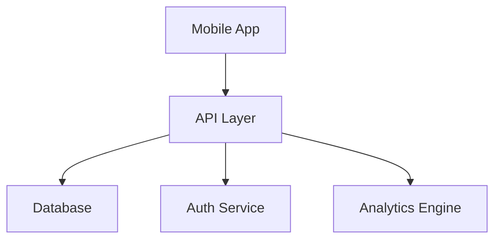

<div align="center">

<h1 align='center'>
  ```
                 $ WalletWise
     Smart Money Management Made Simple
```

</h1>
[](https://expo.dev/)
[](https://supabase.com)
[](https://reactnative.dev/)

</div>

## 🌟 Overview

WalletWise is your intelligent finance companion that transforms the way you manage money. Stop struggling with spreadsheets and manual entries - let WalletWise handle the heavy lifting while you focus on making better financial decisions.

### ✨ Key Features

🔄 **Seamless Transaction Tracking**
- Real-time expense monitoring
- Automatic categorization
- Quick-add expense interface

📊 **Smart Analytics**
- Visual spending breakdowns
- Trend analysis
- Custom reports generation

🔔 **Intelligent Alerts**
- Customizable budget notifications
- Spending limit warnings
- Bill payment reminders

🔒 **Bank-Grade Security**
- End-to-end encryption
- Secure authentication
- Private data protection

## 🚀 Getting Started

### Prerequisites

Make sure you have the following installed:
```bash
node -v # >= 12.5.1
npm -v  # >= 6.0.0
expo -V # >= 47.0.0
```

### Quick Start

1️⃣ **Clone & Install**
```bash
# Clone the repository
git clone https://github.com/yourusername/walletwise.git

# Navigate to the project
cd walletwise

# Install dependencies
npm install
```

2️⃣ **Configure Environment**
```bash
# Copy the example env file
cp .env.example .env

# Add your configuration values
nano .env
```

3️⃣ **Run Development Server**
```bash
# Start Expo development server
npx expo start
```

### 📱 Building for Testing

```bash
# Build preview version
eas build --profile preview
```

## 🏗️ Architecture



## 📦 Tech Stack

### Frontend 🎨
- **Framework**: React Native with Expo
- **UI Components**: React Native Paper
- **State Management**: React Context API
- **Camera Integration**: Expo Camera

### Backend 🛠
- **Database**: PostgreSQL
- **Backend as a Service**: Supabase
- **Authentication**: Supabase Auth
- **Storage**: Supabase Storage

## 📸 Screenshots

<div align="center">
<table>
  <tr>
    <td></td>
    <td></td>
    <td></td>
  </tr>
  <tr>
    <td align="center"><strong>Home Screen</strong></td>
    <td align="center"><strong>Analytics</strong></td>
    <td align="center"><strong>Add Expense</strong></td>
  </tr>
</table>
</div>

## 🧪 Testing

```bash
# Run all tests
npm test

# Run specific test suite
npm test -- -t "auth"
```

## 🤝 Contributing

We love contributions! Here's how you can help:

1. 🍴 Fork the repository
2. 🌿 Create your feature branch (`git checkout -b feature/AmazingFeature`)
3. 💾 Commit your changes (`git commit -m 'Add some AmazingFeature'`)
4. 📤 Push to the branch (`git push origin feature/AmazingFeature`)
5. 🔍 Open a Pull Request

## 👥 Team

Meet the brilliant minds behind WalletWise:

| Name | Role | GitHub |
|------|------|--------|
| AnandKumar NS | Full Stack & AI Services Developer | [@anandkumar](https://github.com/anandkumar) |
| Bragadeesh V | Backend Developer | [@bragadeesh](https://github.com/bragadeesh) |
| M Raj Ragavender | UI/UX Designer | [@rajragavender](https://github.com/rajragavender) |
| Naveen Ragav | Full Stack Developer | [@naveenragav](https://github.com/naveenragav) |
| S Karthikeyan | UI/UX Engineer | [@karthikeyan](https://github.com/karthikeyan) |

## 📜 License

This project is licensed under the MIT License - see the [LICENSE](LICENSE) file for details.

## 🙏 Acknowledgments

Special thanks to:
- Mr. J. Prakash for the invaluable guidance

---

<div align="center">


[Report Bug](https://github.com/yourusername/walletwise/issues) · [Request Feature](https://github.com/yourusername/walletwise/issues)

</div>
